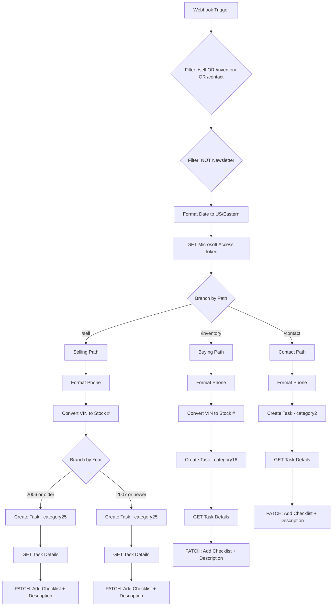

# Microsoft Planner Integration Plan

## Zapier Workflow Analysis

The exported Zapier workflow handles form submissions from three paths and creates Microsoft Planner tasks:




### Key Configuration from Zapier Export


| Setting   | Value                                  |
| --------- | -------------------------------------- |
| Plan ID   | `EeAIt4dnb0qn5zvG8bK232UAGAXJ`         |
| Bucket ID | `5sFcebj1S0-pCBHOcjxATmUACXTA`         |
| Tenant ID | `a66cbac4-0703-42ae-b8a4-d9f3c5412b9e` |
| Client ID | `e6c727f1-4823-4ef2-ae30-1ee96bbde08e` |
| Assignees | 3 users (IDs in export)                |


### Task Categories


| Category     | Path       | Description                 |
| ------------ | ---------- | --------------------------- |
| `category2`  | All        | Base category for all tasks |
| `category16` | /inventory | Buying/vehicle inquiry      |
| `category25` | /sell      | Selling (FSBO)              |


### Standard Checklist (all tasks)

1. Customer Contacted
2. Additional Information Received
3. Photos + Dropbox Created in Prospective Folder
4. Purchase Confirmed
5. EAG Denying Purchase

---

## Implementation Plan

### 1. Create Microsoft Graph Service Module

Create `[apps/website/lib/microsoft/index.ts](apps/website/lib/microsoft/index.ts)` with:

- OAuth client credentials flow for access token
- Token caching with expiry handling
- Planner task creation API wrapper
- Task details update API wrapper

```typescript
// Core functions needed:
async function getAccessToken(): Promise<string>
async function createPlannerTask(data: PlannerTaskInput): Promise<PlannerTask>
async function updateTaskDetails(taskId: string, etag: string, details: TaskDetails): Promise<void>
```

### 2. Create Planner Types

Create `[apps/website/lib/microsoft/types.ts](apps/website/lib/microsoft/types.ts)` with TypeScript interfaces for:

- `PlannerTaskInput` - task creation payload
- `PlannerTask` - API response
- `TaskDetails` - checklist and description
- `FormSubmissionType` - union of sell/vehicle/contact

### 3. Create Planner Task Builder

Create `[apps/website/lib/microsoft/planner.ts](apps/website/lib/microsoft/planner.ts)` with:

- `buildSellTask()` - for /sell submissions (FSBO)
- `buildVehicleInquiryTask()` - for /inventory inquiries
- `buildContactTask()` - for /contact submissions
- `getStockNumber(vin)` - extract last 7 chars of VIN
- `formatPhoneNumber(phone)` - format to US standard
- `buildChecklist()` - standard 5-item checklist
- `buildDescription()` - format customer/vehicle info

### 4. Extend Existing API Routes

#### `[apps/website/app/api/contact/sell/route.ts](apps/website/app/api/contact/sell/route.ts)`

Add after database insert:

```typescript
// After Prisma create and email send
await createPlannerTaskForSell({
  firstName, lastName, email, phone,
  year, make, model, mileage, vin,
  notes, existingCustomer, sellOption,
  submittedAt: new Date()
});
```

#### `[apps/website/app/api/contact/vehicle/route.ts](apps/website/app/api/contact/vehicle/route.ts)`

Add after email send:

```typescript
// After Resend email
await createPlannerTaskForVehicleInquiry({
  firstName, lastName, email, phone,
  vehicleName: vehicle.title,
  vehicleUrl: `https://enthusiastauto.com/vehicles/${slug}`,
  message, existingCustomer,
  submittedAt: new Date()
});
```

#### Create `[apps/website/app/api/contact/route.ts](apps/website/app/api/contact/route.ts)`

Implement the missing general contact endpoint:

```typescript
// POST /api/contact
// Validate with Zod, send email, create Planner task
```

### 5. Environment Variables

Add to `.env.local`:

```bash
# Microsoft Graph API (Planner)
MICROSOFT_TENANT_ID=a66cbac4-0703-42ae-b8a4-d9f3c5412b9e
MICROSOFT_CLIENT_ID=e6c727f1-4823-4ef2-ae30-1ee96bbde08e
MICROSOFT_CLIENT_SECRET=<new_secret_required>
MICROSOFT_PLANNER_PLAN_ID=EeAIt4dnb0qn5zvG8bK232UAGAXJ
MICROSOFT_PLANNER_BUCKET_ID=5sFcebj1S0-pCBHOcjxATmUACXTA
```

**Note:** The client secret from the Zapier export is exposed and should be rotated. Generate a new secret in Azure AD.

### 6. Error Handling Strategy

- Planner task creation should not block form submission
- Use try/catch with logging for Planner API calls
- Return success to user even if Planner fails
- Log failures for monitoring/retry

```typescript
try {
  await createPlannerTask(data);
} catch (error) {
  console.error('[Planner] Task creation failed:', error);
  // Don't throw - form submission should still succeed
}
```

---

## File Structure

```
apps/website/
├── lib/
│   └── microsoft/
│       ├── index.ts          # Main exports, access token
│       ├── types.ts          # TypeScript interfaces
│       ├── planner.ts        # Task builders
│       └── __tests__/
│           └── planner.test.ts
├── app/
│   └── api/
│       └── contact/
│           ├── route.ts      # NEW: General contact endpoint
│           ├── sell/route.ts # EXTEND: Add Planner integration
│           └── vehicle/route.ts # EXTEND: Add Planner integration
```

---

## Data Mapping

### Sell Form → Planner Task


| Form Field             | Planner Field                       |
| ---------------------- | ----------------------------------- |
| `firstName + lastName` | Task title (with year/model/stock#) |
| `submittedAt`          | `startDateTime`                     |
| `year < 2007`          | category25 (FSBO 2006 & Older)      |
| `year >= 2007`         | category25 (FSBO 2007 & Newer)      |
| All customer info      | Task description                    |
| Vehicle details        | Task description                    |


### Vehicle Inquiry → Planner Task


| Form Field                           | Planner Field       |
| ------------------------------------ | ------------------- |
| `firstName + lastName + stockNumber` | Task title          |
| `submittedAt`                        | `startDateTime`     |
| category2 + category16               | `appliedCategories` |
| Customer + vehicle info              | Task description    |


### Contact Form → Planner Task


| Form Field              | Planner Field       |
| ----------------------- | ------------------- |
| `firstName + lastName`  | Task title          |
| `submittedAt`           | `startDateTime`     |
| category2 only          | `appliedCategories` |
| Customer info + message | Task description    |


---

## Security Considerations

1. **Rotate the client secret** - The one in the Zapier export is compromised
2. **Store credentials in environment variables** - Never commit to repo
3. **Use server-side only** - Never expose Microsoft credentials to client
4. **Validate all inputs** - Continue using Zod schemas
5. **Rate limit API routes** - Already implemented for vehicle inquiries

---

## Testing Strategy

1. Unit tests for task builders (mock API calls)
2. Integration test with test Planner plan (if available)
3. Manual testing of each form type
4. Verify task appears in Planner with correct:
  - Title format
  - Categories/labels
  - Assignees
  - Checklist items
  - Description content

