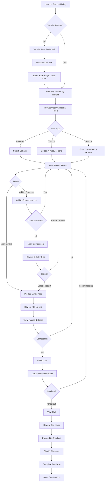
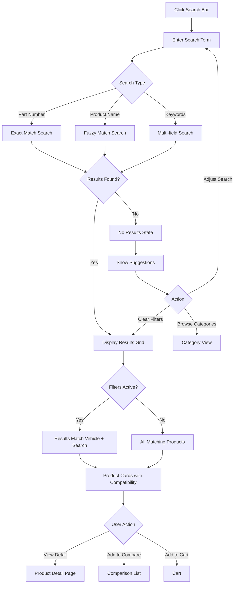
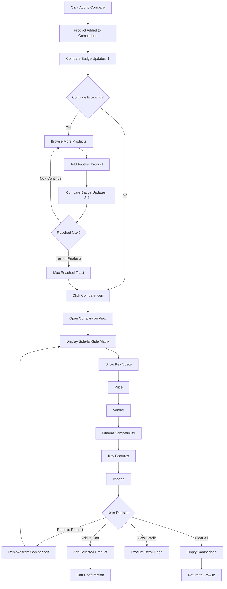
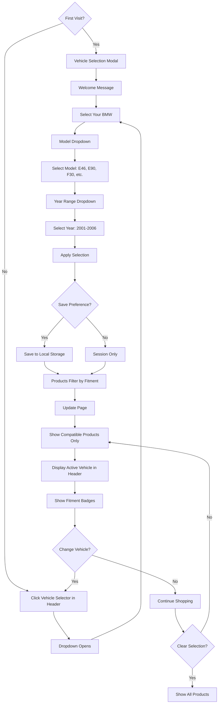

# Enthusiast Auto Ecommerce Site UX/UI Specification

_Generated on 2025-10-14 by Mike_

## Executive Summary

This UX specification defines the user experience and interface design for shop.enthusiastauto.com, a BMW-specific parts e-commerce platform. The site transforms an existing commerce template into a production-ready marketplace with intelligent vehicle fitment filtering as its core differentiation.

**Project Scope:** Level 2 medium project (12 stories, 2 epics, 83 story points)
**Platform:** Responsive web application (mobile-first)
**Target Users:** BMW enthusiasts and owners seeking compatible aftermarket parts
**Key Innovation:** Year-Make-Model fitment filtering that eliminates incompatible products

**Design Goals:**

- Exceed the visual quality of enthusiastauto.com main site
- Deliver a delightful, modern e-commerce experience
- Make vehicle compatibility instantly clear
- Enable confident purchasing decisions through comparison tools
- Maintain template-friendly architecture for straightforward implementation

**Technology Stack:** ShadCN component library, Shopify integration, Webflow Devlink for cross-site components

---

## 1. UX Goals and Principles

### 1.1 Target User Personas

#### Primary Persona: Alex - The Enthusiast Owner

- **Age:** 28-45
- **Occupation:** Professional with disposable income for vehicle modifications
- **BMW:** E46 M3 (2001-2006) or similar enthusiast model
- **Goals:** Find quality, compatible aftermarket parts to enhance performance/aesthetics
- **Pain Points:**
  - Uncertainty about part compatibility with specific year/model
  - Overwhelmed by too many incompatible options on generic sites
  - Wants curated selection from reputable vendors
- **Tech Savviness:** High - comfortable with online shopping, expects modern UX
- **Shopping Behavior:** Research-heavy, compares options, values visual confirmation of fitment

#### Secondary Persona: Mike - The DIY Mechanic

- **Age:** 35-55
- **Occupation:** Independent mechanic or hobbyist
- **BMW:** Works on various BMW models
- **Goals:** Quickly find specific parts by part number or category
- **Pain Points:**
  - Needs fast, efficient search - no time for browsing
  - Must verify fitment across multiple vehicle years
- **Tech Savviness:** Medium - functional but prefers straightforward interfaces
- **Shopping Behavior:** Direct, knows what they want, price-conscious

### 1.2 Usability Goals

1. **Ease of Learning** - First-time visitors can find compatible parts within 2 minutes
2. **Efficiency** - Returning users can complete a purchase in under 3 minutes from landing
3. **Error Prevention** - Fitment filtering prevents adding incompatible parts to cart
4. **Confidence** - Clear visual indicators build trust in compatibility before purchase
5. **Mobile Excellence** - 60%+ of traffic expected on mobile; experience must be flawless

### 1.3 Design Principles

1. **Clarity Over Cleverness** - Industry-standard e-commerce patterns, self-explanatory interactions
2. **Fitment First** - Vehicle compatibility visible at every touchpoint
3. **Progressive Disclosure** - Essential info upfront, details on demand
4. **Touch-Friendly Mobile** - Thumb-zone optimization, 44px minimum touch targets
5. **Fast Feedback** - Immediate visual confirmation for every user action

---

## 2. Information Architecture

### 2.1 Site Map

```
shop.enthusiastauto.com
│
├── Product Listing Page (Home/Landing)
│   ├── Vehicle Selector Interface
│   ├── Filter Panel (Vendor, Category)
│   ├── Product Grid
│   └── Pagination/Infinite Scroll
│
├── Product Detail Page
│   ├── Image Gallery
│   ├── Product Information
│   ├── Fitment Compatibility Display
│   ├── Add to Cart/Compare
│   └── Related Products (optional)
│
├── Search Results
│   ├── Search Query Display
│   ├── Active Filters
│   ├── Results Grid
│   └── "No Results" State
│
├── Product Comparison
│   ├── Comparison Matrix (2-4 products)
│   ├── Side-by-Side Specs
│   └── Add to Cart Actions
│
├── Shopping Cart
│   ├── Cart Items List
│   ├── Quantity Controls
│   ├── Subtotal Display
│   └── Checkout CTA (→ Shopify)
│
└── Shopify Checkout (External)
    ├── Shipping Info
    ├── Payment
    └── Order Confirmation
```

**Notes:**

- Homepage IS the product listing - no separate landing page
- No account/profile pages (Shopify handles guest checkout)
- No wishlist/favorites for MVP
- Navigation shared with enthusiastauto.com via Webflow Devlink

### 2.2 Navigation Structure

#### Primary Navigation (Desktop)

**Header Layout:**

```
┌─────────────────────────────────────────────────────────────────┐
│ [Logo] [Vehicle: E46 2001-2006 ▼]  [Search Bar]  [Compare(2)] [Cart(3)] │
└─────────────────────────────────────────────────────────────────┘
│ Home | Categories ▼ | Vendors ▼ | About | Contact                │ ← Shared Nav (Webflow Devlink)
└─────────────────────────────────────────────────────────────────┘
```

**Key Elements:**

- **Logo** - Returns to product listing
- **Vehicle Selector** - Persistent dropdown showing current vehicle selection
- **Search Bar** - Global product search (prominent, centered)
- **Compare Icon** - Badge showing count of products in comparison (0-4)
- **Cart Icon** - Badge showing item count
- **Shared Navigation** - Links to main enthusiastauto.com site sections

#### Mobile Navigation (< 768px)

**Collapsed Header:**

```
┌──────────────────────────────────────────┐
│ [☰] [Logo]         [Search] [Cart(3)]    │
└──────────────────────────────────────────┘
```

**Expanded Menu (Slide-out):**

```
┌──────────────────────────────────────┐
│  [X] Close                            │
│                                       │
│  🚗 My Vehicle                        │
│      E46 2001-2006          [Change] │
│  ─────────────────────────────────── │
│  🔍 Search Parts                     │
│  📦 Categories                       │
│      ↳ Exhaust                       │
│      ↳ Suspension                    │
│      ↳ Interior                      │
│      ↳ [All Categories]              │
│  🏷️ Vendors                          │
│  ⚖️ Compare (2)                      │
│  ─────────────────────────────────── │
│  Home                                │
│  About                               │
│  Contact                             │
└──────────────────────────────────────┘
```

#### Secondary Navigation

**Filter Panel (Sidebar on Desktop, Drawer on Mobile):**

- Vehicle Fitment (Year/Model dropdowns)
- Category checkboxes
- Vendor checkboxes
- Price range slider
- Clear All Filters button

**Breadcrumbs:**

- `Home > [Category] > [Product Name]`
- Appears on Product Detail pages

#### Footer Navigation

**Shared Component** (Webflow Devlink from enthusiastauto.com):

- About Links
- Contact Information
- Social Media
- Legal (Privacy, Terms)
- BMW service facility info

**Note:** Footer sync managed via Webflow Devlink integration

---

## 3. User Flows

### 3.1 Flow 1: Finding and Purchasing Compatible Parts (Primary Flow)

**User Goal:** Find a performance exhaust compatible with my BMW E46 and complete purchase

**Entry Points:**

- Direct URL (shop.enthusiastauto.com)
- Link from main enthusiastauto.com site
- Search engine result



**Success Criteria:**

- User successfully identifies compatible parts within 2 minutes
- Clear fitment indicators prevent incompatible additions
- Smooth transition to Shopify checkout

**Error States:**

- No fitment match: Show "No compatible parts" with suggestion to adjust filters
- Out of stock: Display "Notify when available" option
- Cart sync failure: Fallback to local cart with warning

---

### 3.2 Flow 2: Quick Product Search

**User Goal:** Find specific part by name or part number

**Entry Point:** Search bar (header, always visible)



**Success Criteria:**

- Search executes within 500ms
- Results respect active vehicle/filters
- Partial matches shown if no exact match

---

### 3.3 Flow 3: Product Comparison

**User Goal:** Compare multiple exhaust options to make informed decision

**Entry Point:** "Add to Compare" button on product cards



**Success Criteria:**

- Up to 4 products can be compared
- Key differentiators clearly visible
- Easy to add winning product to cart

---

### 3.4 Flow 4: Vehicle Selection/Change

**User Goal:** Select or change my BMW model to see compatible parts

**Entry Points:**

- First visit (modal prompt)
- Header vehicle selector
- Filter panel



**Success Criteria:**

- Vehicle selection persists across sessions
- Instant product filtering upon selection
- Easy to change or clear vehicle
- Visual confirmation of active selection

**Edge Cases:**

- Universal fit products: Show regardless of vehicle selection
- No fitment data: Display with "Check Fitment" warning
- Multiple vehicle selection: Future enhancement, show warning for MVP

---

### Flow Summary

**4 Critical Flows Defined:**

1. ✅ **Finding & Purchasing** - Complete journey from landing to checkout
2. ✅ **Quick Search** - Fast part lookup by name/number
3. ✅ **Product Comparison** - Side-by-side evaluation tool
4. ✅ **Vehicle Selection** - Fitment filtering foundation

**Key Interaction Patterns:**

- Progressive disclosure (details on demand)
- Persistent context (vehicle selection)
- Non-blocking actions (compare while browsing)
- Clear escape routes (back to browse, clear filters)

---

## 4. Component Library and Design System

### 4.1 Design System Approach

**Selected Framework:** ShadCN UI (specified in PRD NFR003)

**Rationale:**

- Built on Radix UI primitives for accessibility
- Tailwind CSS based (aligns with modern React ecosystem)
- Copy-paste components (template-friendly, not npm dependency)
- Highly customizable to match brand
- Excellent TypeScript support
- Built-in dark mode support (future enhancement)

**Implementation Strategy:**

1. Install ShadCN CLI and initialize in project
2. Copy needed components into `/components/ui` directory
3. Customize theme tokens in `tailwind.config.js`
4. Extend with custom e-commerce components
5. Document component usage in Storybook (optional for MVP)

**Customization Areas:**

- Color palette (align with enthusiastauto.com brand)
- Typography scale
- Border radius (slightly more rounded for modern feel)
- Animation timing
- Spacing scale

### 4.2 Core Components

#### 4.2.1 Product Card Component

**Purpose:** Display product in grid with essential info and actions

**Variants:**

- `default` - Standard product card with all info
- `compact` - Reduced info for mobile
- `featured` - Larger with additional details

**States:**

- `default` - Standard idle state
- `hover` - Elevated shadow, zoom effect on image
- `loading` - Skeleton loader
- `out-of-stock` - Overlay with "Notify Me" CTA
- `incompatible` - Greyed out with warning (filtered by fitment)

**Anatomy:**

```
┌───────────────────────────────┐
│   [Product Image]              │ ← Aspect ratio 1:1, lazy loaded
│   🟢 Fits Your BMW Badge       │ ← Conditional fitment indicator
├───────────────────────────────┤
│ Product Title (truncate 2 lines)│
│ Vendor Name                    │
│ $399.99                        │
├───────────────────────────────┤
│ [Add to Cart]  [⚖️ Compare]   │ ← Action buttons
└───────────────────────────────┘
```

**Key Features:**

- Image zoom on hover (desktop)
- Fitment badge (green checkmark or "Check Fitment")
- Quick add to cart without leaving page
- Compare checkbox/button
- Vendor badge
- Stock status indicator

---

#### 4.2.2 Button Component (ShadCN)

**Variants:**

- `primary` - High emphasis actions (Add to Cart, Checkout)
- `secondary` - Medium emphasis (View Details, Compare)
- `outline` - Low emphasis (Cancel, Clear Filters)
- `ghost` - Minimal (icon buttons, tertiary actions)
- `link` - Text link style

**States:**

- `default` - Idle
- `hover` - Slightly darker, shadow
- `active` - Pressed state
- `disabled` - Greyed out, no interaction
- `loading` - Spinner icon, disabled interaction

**Sizes:**

- `sm` - 32px height (mobile, compact spaces)
- `md` - 40px height (default)
- `lg` - 48px height (primary CTAs, mobile)

---

#### 4.2.3 Vehicle Selector Component (Custom)

**Purpose:** Persistent dropdown for selecting BMW year/model

**Anatomy:**

```
┌────────────────────────────────┐
│ 🚗 Vehicle: E46 2001-2006  ▼  │ ← Header persistent
└────────────────────────────────┘
     │
     ├─ Dropdown opens
     ↓
┌────────────────────────────────┐
│ Select Your BMW                │
├────────────────────────────────┤
│ Model:                         │
│ [Dropdown: E46, E90, F30...]   │
│                                │
│ Year Range:                    │
│ [Dropdown: 2001-2006...]       │
│                                │
│ [Apply]          [Clear]       │
└────────────────────────────────┘
```

**States:**

- `no-selection` - Placeholder "Select Your BMW"
- `selected` - Shows "Model Year-Year"
- `open` - Dropdown visible
- `error` - Invalid selection

**Behavior:**

- Saves to localStorage
- Triggers product filtering on change
- Prominent on first visit (modal)
- Always accessible in header

---

#### 4.2.4 Filter Panel Component (Custom)

**Purpose:** Sidebar/drawer for advanced filtering

**Desktop Layout:**

```
┌──────────────────────┐
│ Filters              │
│ [Clear All]          │
├──────────────────────┤
│ ▼ Vehicle Fitment    │
│   [Vehicle Selector] │
├──────────────────────┤
│ ▼ Category           │
│   ☐ Exhaust (45)     │
│   ☐ Suspension (32)  │
│   ☐ Interior (28)    │
│   ☐ Exterior (51)    │
├──────────────────────┤
│ ▼ Vendor             │
│   ☐ Akrapovic (12)   │
│   ☐ Borla (8)        │
│   ☐ KW (15)          │
│   [Show more...]     │
├──────────────────────┤
│ ▼ Price Range        │
│   [$0 ═══●════ $5k]  │
└──────────────────────┘
```

**Mobile:** Slide-out drawer from bottom or left

**Behavior:**

- Collapsible sections
- Product count updates live
- Active filters shown as badges
- "Clear All" resets to default

---

#### 4.2.5 Search Bar Component (ShadCN Input + Custom)

**Anatomy:**

```
┌─────────────────────────────────────┐
│ 🔍 Search parts, part numbers...  ⌘K │
└─────────────────────────────────────┘
```

**States:**

- `idle` - Placeholder text
- `focused` - Border highlight, dropdown suggestions
- `typing` - Shows autocomplete (future)
- `searching` - Loading spinner

**Features:**

- Keyboard shortcut (Cmd/Ctrl + K)
- Clear button (X) when text entered
- Submit on Enter key
- Respects active vehicle filters

---

#### 4.2.6 Product Comparison Component (Custom)

**Desktop View:**

```
┌──────┬──────┬──────┬──────┐
│ Img  │ Img  │ Img  │ Img  │
├──────┼──────┼──────┼──────┤
│Title │Title │Title │Title │
│$399  │$499  │$299  │$599  │
├──────┼──────┼──────┼──────┤
│Vendor│Vendor│Vendor│Vendor│
├──────┼──────┼──────┼──────┤
│✓ Fits│✓ Fits│✓ Fits│✓ Fits│
├──────┼──────┼──────┼──────┤
│[Cart]│[Cart]│[Cart]│[Cart]│
│[ X ] │[ X ] │[ X ] │[ X ] │
└──────┴──────┴──────┴──────┘
```

**Mobile:** Horizontal scroll cards

**Features:**

- Max 4 products
- Remove individual products
- "Clear All" button
- Add to cart from comparison
- Link to product details

---

#### 4.2.7 Cart Component (ShadCN Sheet + Custom)

**Slide-out Panel:**

```
┌────────────────────────────────┐
│ Cart (3)               [Close] │
├────────────────────────────────┤
│ [Img] Product Name             │
│       Vendor                   │
│       $399  [- 1 +]      [×]   │
├────────────────────────────────┤
│ [Img] Product Name             │
│       Vendor                   │
│       $299  [- 2 +]      [×]   │
├────────────────────────────────┤
│                                │
│ Subtotal:           $997.00    │
│ ────────────────────────────── │
│ [Continue Shopping]            │
│ [Checkout] ──────────────────► │
└────────────────────────────────┘
```

**Features:**

- Quantity controls (+/-)
- Remove item (X)
- Subtotal calculation
- Smooth slide-in animation
- Persistent across navigation

---

#### 4.2.8 Badge Component (ShadCN)

**Usage:**

- Fitment status: `✓ Fits Your BMW` (green)
- Cart count: `(3)` on cart icon
- Compare count: `(2)` on compare icon
- Stock status: `In Stock`, `Low Stock`, `Out of Stock`
- Vendor badge on product cards

**Variants:**

- `success` - Green (compatible)
- `warning` - Yellow (check fitment)
- `error` - Red (incompatible/out of stock)
- `neutral` - Gray (info, vendor)

---

#### 4.2.9 Toast Notification (ShadCN Sonner)

**Purpose:** Non-blocking feedback for user actions

**Use Cases:**

- "Added to cart" (success)
- "Added to compare" (info)
- "Removed from cart" (neutral)
- "Item out of stock" (warning)
- "Error adding to cart" (error)

**Behavior:**

- Auto-dismiss after 3-5 seconds
- Stacks multiple toasts
- Swipe to dismiss (mobile)
- Action button optional (Undo, View Cart)

---

#### 4.2.10 Loading States

**Skeleton Loader:**

- Product card skeleton during data fetch
- Shimmer animation effect
- Maintains layout to prevent shift

**Spinner:**

- Button loading states
- Search in progress
- Page transitions

---

#### 4.2.11 Modal/Dialog Component (ShadCN)

**Use Cases:**

- Vehicle selection on first visit
- Product image lightbox
- Confirmation dialogs
- Error messages

**Features:**

- Backdrop overlay
- Close on ESC key
- Keyboard trap for accessibility
- Responsive sizing

---

### Component Implementation Priority

**Sprint 1 (Core):**

1. Button
2. Product Card
3. Vehicle Selector
4. Search Bar

**Sprint 2 (Filters & Cart):** 5. Filter Panel 6. Cart Component 7. Badge 8. Toast

**Sprint 3 (Enhanced):** 9. Product Comparison 10. Modal/Dialog 11. Loading States

**Sprint 4 (Polish):** 12. Animations & Transitions 13. Empty States 14. Error States

---

## 5. Visual Design Foundation

### 5.1 Color Palette

**Brand Personality:** Professional, Premium, Performance-Oriented, Modern

**Brand Colors (Enthusiast Auto):**

```css
/* Primary Brand Colors */
--brand-red: #d12026; /* Primary CTA color, urgent actions */
--brand-navy: #292664; /* Dark accent, headings, premium elements */
--brand-blue: #529bca; /* Primary brand blue - links, active states */
--brand-dark: #141c27; /* Darkest - text, high contrast elements */
```

**Extended Primary Palette (based on brand blue #529BCA):**

```css
--primary-50: #f0f9ff; /* Lightest blue tint */
--primary-100: #e0f2fe;
--primary-200: #b8e5fd;
--primary-300: #7dd3fc;
--primary-400: #52a9cc;
--primary-500: #529bca; /* Brand blue (main) */
--primary-600: #3f7fa8; /* Hover states for blue elements */
--primary-700: #2d5f7e; /* Pressed states */
--primary-800: #1e4154;
--primary-900: #0f2a3a; /* Darkest */
```

**Semantic Colors:**

```css
/* Success (Compatible/In Stock) */
--success-50: #f0fdf4;
--success-500: #22c55e; /* Fitment badge, positive states */
--success-700: #15803d;

/* Warning (Check Fitment) */
--warning-50: #fffbeb;
--warning-500: #f59e0b; /* Check fitment, low stock */
--warning-700: #b45309;

/* Error (Incompatible/Out of Stock) */
--error-50: #fef2f2;
--error-500: #ef4444; /* Out of stock, errors */
--error-700: #b91c1c;

/* Neutral (Text, Backgrounds) */
--neutral-50: #fafafa; /* Page background */
--neutral-100: #f5f5f5; /* Card background */
--neutral-200: #e5e5e5; /* Borders */
--neutral-400: #a3a3a3; /* Disabled text */
--neutral-600: #525252; /* Secondary text */
--neutral-800: #262626; /* Body text */
--neutral-900: #171717; /* Headings */
```

**Accent Colors:**

```css
--accent-orange: #f97316; /* CTAs, special badges */
--accent-blue: #0ea5e9; /* Links, info */
```

**Color Usage Guidelines:**

- **Brand Blue (#529BCA)** - Links, active states, secondary buttons, info badges
- **Brand Red (#D12026)** - Primary CTAs (Add to Cart, Checkout), urgent actions
- **Brand Navy (#292664)** - Headings, premium badges, high-value elements
- **Brand Dark (#141C27)** - Body text, headings, high-contrast elements
- **Success Green** - "Fits Your BMW" badges, in-stock indicators, success messages
- **Warning Yellow** - "Check Fitment" warnings, low stock alerts
- **Error Red** - Out of stock, incompatible products, error states
- **Neutral Grays** - Secondary text, backgrounds, borders, disabled states

**Contrast Ratios:**

- Text on white: Minimum 4.5:1 (WCAG AA)
- Primary buttons: 4.5:1 contrast
- Large text (18px+): 3:1 minimum

---

### 5.2 Typography

**Font Families:**

**Primary:** Inter (System Font Alternative: -apple-system, BlinkMacSystemFont, "Segoe UI")

- **Reason:** Clean, modern, excellent readability, optimized for screens
- **Weights:** 400 (Regular), 500 (Medium), 600 (Semibold), 700 (Bold)
- **Usage:** Body text, UI elements, most content

**Display/Headings:** Outfit (Fallback: Inter)

- **Reason:** Geometric, distinctive, premium feel
- **Weights:** 600 (Semibold), 700 (Bold)
- **Usage:** H1, H2, hero text, product titles

**Monospace:** JetBrains Mono (Fallback: Consolas, Monaco)

- **Usage:** Part numbers, SKUs, technical specs

---

**Type Scale:**

```css
/* Headings */
--text-xs: 0.75rem; /* 12px - Labels, captions */
--text-sm: 0.875rem; /* 14px - Small UI text */
--text-base: 1rem; /* 16px - Body text (default) */
--text-lg: 1.125rem; /* 18px - Large body, product titles */
--text-xl: 1.25rem; /* 20px - H6, card headings */
--text-2xl: 1.5rem; /* 24px - H5 */
--text-3xl: 1.875rem; /* 30px - H4 */
--text-4xl: 2.25rem; /* 36px - H3 */
--text-5xl: 3rem; /* 48px - H2 */
--text-6xl: 3.75rem; /* 60px - H1 (rarely used) */
```

**Line Heights:**

```css
--leading-tight: 1.25; /* Headings */
--leading-normal: 1.5; /* Body text */
--leading-relaxed: 1.75; /* Emphasized content */
```

**Font Weights:**

```css
--font-normal: 400; /* Body text */
--font-medium: 500; /* Emphasis, buttons */
--font-semibold: 600; /* Subheadings, important UI */
--font-bold: 700; /* Headings, strong emphasis */
```

**Typography Usage:**

- **Product Titles:** text-lg, font-semibold, leading-tight
- **Body Text:** text-base, font-normal, leading-normal
- **Prices:** text-xl, font-bold
- **Buttons:** text-sm or text-base, font-medium
- **Labels:** text-xs, font-medium, uppercase, tracking-wide
- **Vendor Names:** text-sm, font-normal, text-neutral-600

---

### 5.3 Spacing and Layout

**Spacing Scale (Tailwind-based):**

```css
--space-0: 0;
--space-1: 0.25rem; /*  4px */
--space-2: 0.5rem; /*  8px */
--space-3: 0.75rem; /* 12px */
--space-4: 1rem; /* 16px - Base unit */
--space-5: 1.25rem; /* 20px */
--space-6: 1.5rem; /* 24px */
--space-8: 2rem; /* 32px */
--space-10: 2.5rem; /* 40px */
--space-12: 3rem; /* 48px */
--space-16: 4rem; /* 64px */
--space-20: 5rem; /* 80px */
--space-24: 6rem; /* 96px */
```

**Common Spacing Patterns:**

- **Card Padding:** space-4 to space-6
- **Button Padding:** space-3 vertical, space-6 horizontal
- **Section Spacing:** space-12 to space-16
- **Stack Spacing (content):** space-4 to space-6
- **Inline Spacing (badges, icons):** space-2

---

**Layout Grid:**

**Container Max-Widths:**

```css
--container-sm: 640px; /* Small screens */
--container-md: 768px; /* Medium screens */
--container-lg: 1024px; /* Large screens */
--container-xl: 1280px; /* XL screens */
--container-2xl: 1536px; /* 2XL screens (max) */
```

**Product Grid:**

- **Mobile:** 1 column (100% width)
- **Tablet:** 2 columns (gap-4)
- **Desktop:** 3-4 columns (gap-6)
- **Large Desktop:** 4 columns (gap-8)

**Gutter Spacing:**

- **Mobile:** 1rem (16px)
- **Tablet+:** 1.5rem (24px)
- **Desktop:** 2rem (32px)

---

**Border Radius:**

```css
--radius-none: 0;
--radius-sm: 0.125rem; /* 2px - Inputs */
--radius-md: 0.375rem; /* 6px - Buttons, cards */
--radius-lg: 0.5rem; /* 8px - Modals, large cards */
--radius-xl: 0.75rem; /* 12px - Product images */
--radius-2xl: 1rem; /* 16px - Special elements */
--radius-full: 9999px; /* Pills, badges */
```

**Usage:**

- **Product Cards:** radius-lg
- **Buttons:** radius-md
- **Inputs:** radius-md
- **Badges:** radius-full
- **Product Images:** radius-lg
- **Modals:** radius-xl

---

**Shadows (Elevation):**

```css
--shadow-sm: 0 1px 2px 0 rgb(0 0 0 / 0.05);
--shadow-md: 0 4px 6px -1px rgb(0 0 0 / 0.1);
--shadow-lg: 0 10px 15px -3px rgb(0 0 0 / 0.1);
--shadow-xl: 0 20px 25px -5px rgb(0 0 0 / 0.1);
--shadow-2xl: 0 25px 50px -12px rgb(0 0 0 / 0.25);
```

**Elevation Hierarchy:**

- **Product Cards (idle):** shadow-sm
- **Product Cards (hover):** shadow-md
- **Dropdowns:** shadow-lg
- **Modals:** shadow-xl
- **Cart Panel:** shadow-2xl

---

**Transitions:**

```css
--transition-fast: 150ms ease; /* Buttons, hovers */
--transition-base: 200ms ease; /* Cards, UI elements */
--transition-slow: 300ms ease; /* Modals, drawers */
--transition-smooth: cubic-bezier(0.4, 0, 0.2, 1);
```

**Animation Timing:**

- **Hover Effects:** 150ms
- **Button Clicks:** 100ms
- **Panel Slides:** 300ms
- **Modal Fade:** 200ms
- **Toast Notifications:** 300ms

---

## 6. Responsive Design

### 6.1 Breakpoints

**Strategy:** Mobile-first responsive design (PRD NFR002)

**Breakpoint System:**

```css
/* Mobile (Default) */
@media (min-width: 320px) {
  /* Base styles - mobile-first */
}

/* Small Mobile */
@media (min-width: 375px) {
  /* iPhone 6/7/8 and similar */
}

/* Large Mobile / Small Tablet */
@media (min-width: 640px) {
  /* sm breakpoint */
  --grid-columns: 2;
}

/* Tablet */
@media (min-width: 768px) {
  /* md breakpoint */
  --grid-columns: 2-3;
  /* Sidebar filters visible */
  /* Expanded navigation */
}

/* Desktop */
@media (min-width: 1024px) {
  /* lg breakpoint */
  --grid-columns: 3-4;
  /* Full desktop experience */
}

/* Large Desktop */
@media (min-width: 1280px) {
  /* xl breakpoint */
  --grid-columns: 4;
  /* Max container width */
}

/* Extra Large Desktop */
@media (min-width: 1536px) {
  /* 2xl breakpoint */
  /* Increased spacing, larger type */
}
```

**Target Devices:**

- **Mobile:** iPhone SE (320px), iPhone 12/13/14 (390px), Android phones
- **Tablet:** iPad Mini (768px), iPad (810px), iPad Pro (1024px)
- **Desktop:** MacBook (1280px), MacBook Pro (1440px), iMac (1920px+)

---

### 6.2 Adaptation Patterns

#### 6.2.1 Product Grid Adaptation

**Mobile (< 640px):**

- 1 column layout (100% width)
- Cards stacked vertically
- Full-width product images
- Compact button sizes (44px min height)
- Spacing: space-4 between cards

**Tablet (640px - 1023px):**

- 2 columns (gap-4 or gap-6)
- Product cards maintain aspect ratio
- Filters accessible via drawer/modal
- Medium button sizes (48px height)

**Desktop (1024px+):**

- 3-4 columns (gap-6 or gap-8)
- Sidebar filters always visible (sticky)
- Hover effects enabled
- Large button sizes (52px height for primary CTAs)

---

#### 6.2.2 Navigation Adaptation

**Mobile:**

```
┌──────────────────────────────────────────┐
│ [☰] [Logo]         [Search] [Cart(3)]    │
└──────────────────────────────────────────┘
```

- Hamburger menu for main navigation
- Vehicle selector in slide-out menu
- Search collapses to icon, expands on tap
- Bottom-fixed "Add to Cart" on product detail pages

**Tablet:**

```
┌─────────────────────────────────────────────────────┐
│ [Logo] [Vehicle: E46 ▼] [Search] [Compare] [Cart]  │
│ Home | Categories ▼ | Vendors ▼ | About             │
└─────────────────────────────────────────────────────┘
```

- Full navigation visible
- Condensed vehicle selector
- Search bar always visible

**Desktop:**

```
┌───────────────────────────────────────────────────────────┐
│ [Logo] [Vehicle: E46 2001-2006 ▼]  [Search Bar]  [Compare(2)] [Cart(3)] │
│ Home | Categories ▼ | Vendors ▼ | About | Contact                       │
└───────────────────────────────────────────────────────────┘
```

- Full-width search bar
- All elements visible and expanded
- Dropdowns on hover

---

#### 6.2.3 Filter Panel Adaptation

**Mobile:**

- Slide-out drawer from bottom or left
- "Filters" button fixed at top
- Full-screen modal on smaller devices
- Collapsible sections with accordion pattern
- Sticky "Apply Filters" button at bottom

**Tablet:**

- Slide-out drawer from left (300px width)
- Semi-transparent backdrop
- "Show/Hide Filters" toggle button

**Desktop:**

- Fixed sidebar (240-280px width)
- Always visible (no drawer)
- Sticky position on scroll
- All filter sections expanded by default

---

#### 6.2.4 Product Detail Page Adaptation

**Mobile:**

- Image gallery: full-width swiper/carousel
- Sticky "Add to Cart" bar at bottom
- Content stacked vertically
- Fitment info prominently displayed below images
- Related products: horizontal scroll carousel

**Tablet:**

- 2-column layout: Image (60%) | Info (40%)
- Gallery thumbnails visible
- Standard "Add to Cart" button (not sticky)

**Desktop:**

- 2-column layout: Image (50%) | Info (50%)
- Large image gallery with zoom on hover
- Sidebar sticky on scroll
- Related products: 4-column grid

---

#### 6.2.5 Cart Adaptation

**Mobile:**

- Full-screen overlay cart panel
- Swipe down to close
- Item images smaller (60px)
- Quantity controls: simplified +/- buttons
- Fixed "Checkout" button at bottom

**Tablet & Desktop:**

- Slide-out panel from right (400px width)
- Backdrop overlay
- Item images larger (80px)
- Standard quantity controls
- "Checkout" button in panel footer

---

#### 6.2.6 Touch vs Mouse Interactions

**Mobile (Touch):**

- Minimum 44px touch targets (Apple HIG)
- No hover states (use active/pressed states)
- Swipe gestures for image galleries, cart
- Pull-to-refresh (future enhancement)
- Bottom navigation for critical actions

**Desktop (Mouse):**

- Hover effects on cards, buttons
- Cursor changes (pointer, default)
- Keyboard shortcuts (Cmd+K for search)
- Focus states for keyboard navigation
- Tooltips on hover

---

#### 6.2.7 Performance Optimizations

**Mobile:**

- Lazy load images (progressive)
- Infinite scroll or pagination (lightweight)
- Compressed images (WebP with fallback)
- Minimal animations (respect prefers-reduced-motion)
- Priority: Core Web Vitals (LCP < 2.5s, FID < 100ms)

**Desktop:**

- Larger hero images allowed
- More sophisticated animations
- Preload critical assets
- Optimistic UI updates (cart, filters)

---

## 7. Accessibility

### 7.1 Compliance Target

**Standard:** WCAG 2.1 Level AA

**Rationale:**

- **MVP Deployment Intent:** Early user testing requires solid accessibility baseline
- **E-commerce Legal Requirements:** AA compliance reduces legal risk
- **User Base:** BMW enthusiasts span all ages, abilities, and assistive technology needs
- **Best Practice:** AA is industry standard for commercial websites

**Target Criteria:**

- ✅ **1.4.3 Contrast (Minimum):** 4.5:1 for normal text, 3:1 for large text
- ✅ **1.4.11 Non-text Contrast:** 3:1 for UI components and graphical objects
- ✅ **2.1.1 Keyboard:** All functionality available via keyboard
- ✅ **2.4.7 Focus Visible:** Keyboard focus indicator always visible
- ✅ **3.2.3 Consistent Navigation:** Navigation consistent across pages
- ✅ **4.1.2 Name, Role, Value:** All components have accessible names

**Out of Scope for MVP:**

- AAA compliance (may revisit post-MVP)
- Advanced screen reader optimizations (basic support required)
- Multi-language support (English only for MVP)

---

### 7.2 Key Requirements

#### 7.2.1 Color and Contrast

**Text Contrast:**

- Body text (neutral-800 #262626) on white background: **13.1:1** ✅ (exceeds 4.5:1)
- Headings (brand-dark #141C27) on white background: **15.9:1** ✅
- Secondary text (neutral-600 #525252) on white: **7.4:1** ✅
- Brand blue (#529BCA) on white: **3.1:1** ❌ (use only for links with underline or large text)
- Brand red (#D12026) on white: **5.1:1** ✅ (safe for buttons with white text)

**Button Contrast:**

- Primary button: White text on brand-red background: **5.1:1** ✅
- Secondary button: Brand-dark text on neutral-100 background: **12.8:1** ✅
- Outline button: Brand-blue border must be 3:1 minimum ✅

**UI Components:**

- Form inputs: Border contrast 3:1 minimum
- Focus rings: 3:1 contrast against background
- Disabled state: Must still meet 3:1 for UI component contrast

**Action Items:**

- Run automated contrast checks with axe DevTools
- Test color-blind simulations (protanopia, deuteranopia, tritanopia)
- Never use color alone to convey information (use icons + text)

---

#### 7.2.2 Keyboard Navigation

**Navigation Order:**

1. Skip to main content link (first tab)
2. Logo → Vehicle selector → Search → Compare → Cart
3. Main navigation links
4. Product grid (left-to-right, top-to-bottom)
5. Footer links

**Keyboard Shortcuts:**

- `Tab` - Move focus forward
- `Shift+Tab` - Move focus backward
- `Enter` / `Space` - Activate buttons, links
- `Esc` - Close modals, dropdowns, drawers
- `Cmd/Ctrl+K` - Focus search bar
- `Arrow keys` - Navigate dropdown menus, image galleries

**Interactive Elements:**

- All buttons, links, and form controls must be keyboard accessible
- Focus trap in modals (can't Tab out until closed)
- Roving focus in product grid (arrow key navigation - optional enhancement)

**Focus Indicators:**

- Visible focus ring: 2px solid brand-blue with 2px offset
- Never remove `:focus` styles (`:focus-visible` for mouse users OK)
- Custom focus styles for product cards, buttons, inputs

**Skip Links:**

```html
<a href="#main-content" class="skip-link"> Skip to main content </a>
```

- Visually hidden until focused
- First interactive element on page

---

#### 7.2.3 Screen Reader Support

**Semantic HTML:**

- Use `<nav>`, `<main>`, `<header>`, `<footer>`, `<article>`, `<section>`
- Proper heading hierarchy (H1 → H2 → H3, no skipping levels)
- Lists (`<ul>`, `<ol>`) for product grids, navigation

**ARIA Labels and Roles:**

```html
<!-- Product Card -->
<article aria-label="BMW Performance Exhaust - $399.99">
  
  <h3>Performance Exhaust</h3>
  <span aria-label="Fits your E46 2001-2006">✓ Fits Your BMW</span>
  <button aria-label="Add Performance Exhaust to cart">Add to Cart</button>
</article>

<!-- Cart Icon -->
<button aria-label="Shopping cart: 3 items">
  <svg aria-hidden="true">...</svg>
  <span class="badge">3</span>
</button>

<!-- Loading State -->
<div role="status" aria-live="polite">Loading products...</div>

<!-- Filter Panel -->
<aside role="region" aria-label="Product filters">
  <h2>Filters</h2>
  <!-- Filter controls -->
</aside>
```

**Dynamic Content:**

- `aria-live="polite"` for filter updates, cart changes
- `aria-live="assertive"` for errors only
- `aria-busy="true"` during loading states
- Announce product count changes: "Showing 12 products"

**Image Alt Text:**

- Product images: "BMW E46 Performance Exhaust System by Akrapovic"
- Decorative images: `alt=""` or `aria-hidden="true"`
- Fitment badges: Included in aria-label of parent

---

#### 7.2.4 Forms and Inputs

**Form Labels:**

```html
<label for="search-input">Search parts</label>
<input
  id="search-input"
  type="search"
  aria-describedby="search-hint"
  required
/>
<span id="search-hint">Enter part name or number</span>
```

**Error Messages:**

- Associate errors with inputs using `aria-describedby`
- Error messages visible and announced to screen readers
- Use `aria-invalid="true"` on invalid inputs

**Required Fields:**

- Use `required` attribute
- Visual indicator (asterisk) + text "(required)"

**Vehicle Selector Accessibility:**

```html
<fieldset>
  <legend>Select Your BMW</legend>
  <label for="model">Model</label>
  <select id="model" aria-required="true">
    ...
  </select>

  <label for="year">Year Range</label>
  <select id="year" aria-required="true">
    ...
  </select>
</fieldset>
```

---

#### 7.2.5 Responsive and Mobile Accessibility

**Touch Targets:**

- Minimum 44x44 pixels (WCAG 2.1 AA)
- Spacing between targets: 8px minimum
- Larger targets on mobile (48-52px)

**Zoom and Scaling:**

- Allow pinch-to-zoom (don't disable user-scalable)
- Text reflow at 200% zoom without horizontal scroll
- No fixed font sizes in pixels (use rem/em)

**Orientation:**

- Support both portrait and landscape
- No orientation lock (unless critical to functionality)

---

#### 7.2.6 Multimedia and Animations

**Respect User Preferences:**

```css
@media (prefers-reduced-motion: reduce) {
  * {
    animation-duration: 0.01ms !important;
    animation-iteration-count: 1 !important;
    transition-duration: 0.01ms !important;
  }
}
```

**Image Loading:**

- Lazy loading with proper placeholders
- Skeleton screens maintain layout (no CLS)
- Loading indicators are accessible (aria-live)

**Auto-play:**

- No auto-playing videos or carousels without user control
- Carousel controls keyboard accessible

---

#### 7.2.7 Testing Requirements

**Automated Testing:**

- ✅ axe DevTools (browser extension)
- ✅ Lighthouse accessibility audit (target 90+ score)
- ✅ WAVE (WebAIM evaluation tool)
- ✅ eslint-plugin-jsx-a11y (React)

**Manual Testing:**

- ✅ Keyboard-only navigation (unplug mouse)
- ✅ Screen reader testing:
  - VoiceOver (macOS/iOS)
  - NVDA (Windows)
  - JAWS (Windows - if budget allows)
- ✅ Color contrast verification (Contrast Checker, Stark)
- ✅ 200% browser zoom test
- ✅ Color blindness simulation (Chrome DevTools)

**User Testing:**

- Include users with disabilities in MVP testing
- Test with actual assistive technology users
- Gather feedback on navigation, comprehension

---

#### 7.2.8 Accessibility Checklist

**Before Launch:**

- [ ] All images have alt text
- [ ] Form inputs have labels
- [ ] Color contrast meets AA standards
- [ ] Keyboard navigation works for all features
- [ ] Focus indicators visible
- [ ] ARIA labels on icon buttons
- [ ] Heading hierarchy is logical
- [ ] Skip link implemented
- [ ] Lighthouse accessibility score 90+
- [ ] Screen reader tested on key flows
- [ ] Touch targets meet 44px minimum
- [ ] Zoom to 200% works without horizontal scroll
- [ ] `prefers-reduced-motion` respected

---

## 8. Interaction and Motion

### 8.1 Motion Principles

**Philosophy:** Motion should enhance usability, not distract from it. Animations provide feedback, guide attention, and communicate relationships between UI elements.

**Core Principles:**

1. **Purposeful** - Every animation serves a functional purpose (feedback, transition, guidance)
2. **Subtle** - Animations enhance without demanding attention
3. **Fast** - Quick enough to feel responsive (150-300ms typical)
4. **Natural** - Easing curves mimic real-world physics
5. **Respectful** - Honor `prefers-reduced-motion` user preference

**When to Use Animation:**

- ✅ User action feedback (button clicks, form submissions)
- ✅ State transitions (loading, success, error)
- ✅ Revealing/hiding content (modals, drawers, dropdowns)
- ✅ Guiding attention (new cart item, filter applied)
- ✅ Smooth layout shifts (product grid updates)

**When NOT to Use Animation:**

- ❌ Decorative effects with no functional purpose
- ❌ Slowing down critical user tasks
- ❌ Auto-playing carousels/content
- ❌ Parallax effects that cause motion sickness

---

### 8.2 Key Animations

#### 8.2.1 Button Interactions

**Click/Tap Feedback:**

```css
.button {
  transition:
    transform 100ms ease,
    box-shadow 150ms ease;
}

.button:active {
  transform: scale(0.98);
  box-shadow: var(--shadow-sm);
}

.button:hover {
  box-shadow: var(--shadow-md);
}
```

**Loading State:**

```css
.button--loading::after {
  content: "";
  animation: spin 600ms linear infinite;
}

@keyframes spin {
  to {
    transform: rotate(360deg);
  }
}
```

**Duration:** 100-150ms (click), 600ms (spinner)

---

#### 8.2.2 Product Card Interactions

**Hover Effect (Desktop):**

```css
.product-card {
  transition:
    box-shadow 200ms ease,
    transform 200ms ease;
}

.product-card:hover {
  box-shadow: var(--shadow-md);
  transform: translateY(-4px);
}

.product-card img {
  transition: transform 300ms ease;
}

.product-card:hover img {
  transform: scale(1.05);
}
```

**Add to Cart Success:**

```css
@keyframes bounce-in {
  0% {
    transform: scale(0.9);
    opacity: 0;
  }
  50% {
    transform: scale(1.05);
  }
  100% {
    transform: scale(1);
    opacity: 1;
  }
}

.cart-badge {
  animation: bounce-in 300ms ease-out;
}
```

**Duration:** 200-300ms

---

#### 8.2.3 Modal/Drawer Transitions

**Modal Fade In:**

```css
.modal-backdrop {
  animation: fade-in 200ms ease;
}

.modal-content {
  animation: scale-in 250ms cubic-bezier(0.4, 0, 0.2, 1);
}

@keyframes fade-in {
  from {
    opacity: 0;
  }
  to {
    opacity: 1;
  }
}

@keyframes scale-in {
  from {
    opacity: 0;
    transform: scale(0.95);
  }
  to {
    opacity: 1;
    transform: scale(1);
  }
}
```

**Drawer Slide In (Cart, Filters):**

```css
.drawer {
  animation: slide-in-right 300ms cubic-bezier(0.4, 0, 0.2, 1);
}

@keyframes slide-in-right {
  from {
    transform: translateX(100%);
  }
  to {
    transform: translateX(0);
  }
}
```

**Mobile Drawer (Bottom):**

```css
@keyframes slide-in-bottom {
  from {
    transform: translateY(100%);
  }
  to {
    transform: translateY(0);
  }
}
```

**Duration:** 250-300ms

---

#### 8.2.4 Toast Notifications

**Slide In + Fade:**

```css
.toast {
  animation: toast-in 300ms cubic-bezier(0.4, 0, 0.2, 1);
}

@keyframes toast-in {
  from {
    opacity: 0;
    transform: translateY(20px);
  }
  to {
    opacity: 1;
    transform: translateY(0);
  }
}
```

**Auto-dismiss:**

- Show: 300ms slide + fade in
- Dwell: 4000ms visible
- Dismiss: 200ms fade out

**Duration:** 300ms (in), 200ms (out)

---

#### 8.2.5 Filter Application

**Product Grid Fade/Shuffle:**

```css
.product-grid {
  transition: opacity 150ms ease;
}

.product-grid--updating {
  opacity: 0.6;
}

.product-card {
  animation: fade-in-up 300ms ease backwards;
}

.product-card:nth-child(1) {
  animation-delay: 0ms;
}
.product-card:nth-child(2) {
  animation-delay: 50ms;
}
.product-card:nth-child(3) {
  animation-delay: 100ms;
}
/* Stagger up to 12 items max */

@keyframes fade-in-up {
  from {
    opacity: 0;
    transform: translateY(10px);
  }
  to {
    opacity: 1;
    transform: translateY(0);
  }
}
```

**Filter Badge Animation:**

```css
.filter-badge {
  animation: pop-in 200ms cubic-bezier(0.68, -0.55, 0.265, 1.55);
}

@keyframes pop-in {
  0% {
    transform: scale(0);
  }
  70% {
    transform: scale(1.1);
  }
  100% {
    transform: scale(1);
  }
}
```

**Duration:** 150-300ms staggered

---

#### 8.2.6 Image Loading

**Skeleton to Image:**

```css
.skeleton {
  background: linear-gradient(
    90deg,
    var(--neutral-100) 25%,
    var(--neutral-50) 50%,
    var(--neutral-100) 75%
  );
  background-size: 200% 100%;
  animation: shimmer 1.5s infinite;
}

@keyframes shimmer {
  0% {
    background-position: 200% 0;
  }
  100% {
    background-position: -200% 0;
  }
}

.image-loaded {
  animation: fade-in 300ms ease;
}
```

**Duration:** 1.5s loop (shimmer), 300ms (fade in)

---

#### 8.2.7 Focus Indicators

**Keyboard Focus Ring:**

```css
*:focus-visible {
  outline: 2px solid var(--brand-blue);
  outline-offset: 2px;
  transition: outline-offset 150ms ease;
}

.button:focus-visible {
  outline-offset: 4px; /* Larger offset for buttons */
}
```

**Duration:** 150ms

---

#### 8.2.8 Page Transitions (Optional)

**Product Detail Entry:**

```css
.page-enter {
  animation: fade-in-up 400ms ease;
}
```

**Back to Listing:**

```css
.page-exit {
  animation: fade-out 200ms ease;
}
```

**Duration:** 200-400ms

---

### 8.3 Reduced Motion Accessibility

**Critical Override:**

```css
@media (prefers-reduced-motion: reduce) {
  *,
  *::before,
  *::after {
    animation-duration: 0.01ms !important;
    animation-iteration-count: 1 !important;
    transition-duration: 0.01ms !important;
    scroll-behavior: auto !important;
  }
}
```

**Exceptions (Essential Feedback):**

- Loading spinners (still show, but no rotation)
- Focus indicators (instant, no transition)
- Modal backdrops (instant opacity change)

---

### 8.4 Interaction States Summary

| Element              | Idle           | Hover            | Active     | Focus      | Loading         |
| -------------------- | -------------- | ---------------- | ---------- | ---------- | --------------- |
| **Button (Primary)** | Default        | Shadow + lift    | Scale down | Focus ring | Spinner         |
| **Product Card**     | Shadow-sm      | Shadow-md + lift | -          | Focus ring | Skeleton        |
| **Input**            | Border neutral | Border blue      | -          | Focus ring | -               |
| **Link**             | Blue           | Underline        | -          | Focus ring | -               |
| **Modal**            | -              | -                | -          | -          | Fade + scale in |
| **Drawer**           | -              | -                | -          | -          | Slide in        |
| **Toast**            | -              | -                | -          | -          | Slide + fade    |

---

### 8.5 Animation Performance

**Best Practices:**

- Use `transform` and `opacity` (GPU-accelerated)
- Avoid animating `width`, `height`, `top`, `left` (layout triggers)
- Use `will-change` sparingly for known animations
- Limit concurrent animations (max 3-4 simultaneous)
- Test on low-end devices (iPhone SE, older Android)

**Performance Budget:**

- Page load animations: < 600ms total
- Interaction feedback: < 200ms
- 60fps target for all animations (16.67ms per frame)

---

## 9. Design Files and Wireframes

### 9.1 Design Files

**Status:** MVP project - formal design files are optional

**Approach:**
Since this is a Level 2 project using ShadCN components and a template-friendly architecture, high-fidelity design mockups are **not required before implementation**. The comprehensive UX specification, component definitions, and visual design tokens in this document provide sufficient guidance for development.

**Optional Design Tools (if needed):**

- **Figma** - For component prototyping and stakeholder presentation
- **Excalidraw** - For quick wireframe sketches
- **AI-assisted tools** - Vercel v0, Galileo AI for rapid prototyping
- **In-browser prototyping** - Build directly with ShadCN/Tailwind

**Recommendation for MVP:**
Proceed directly to implementation using this specification. Create design files only if:

1. Stakeholders require visual approval before code
2. Complex interactions need prototyping
3. User testing requires clickable prototypes

---

### 9.2 Key Screen Layouts

#### 9.2.1 Product Listing Page (Homepage)

**Desktop Layout (1280px):**

```
┌─────────────────────────────────────────────────────────────┐
│ [Logo] [Vehicle: E46 ▼] [Search Bar] [Compare(2)] [Cart(3)] │ Header
│ Home | Categories ▼ | Vendors ▼ | About | Contact           │ Nav
└─────────────────────────────────────────────────────────────┘
┌──────────────┬──────────────────────────────────────────────┐
│   Filters    │  Showing 24 products for E46 2001-2006       │
│ ▼ Fitment    │  ┌────────┬────────┬────────┬────────┐       │
│   E46 2001-6 │  │ [Card] │ [Card] │ [Card] │ [Card] │       │
│              │  └────────┴────────┴────────┴────────┘       │
│ ▼ Category   │  ┌────────┬────────┬────────┬────────┐       │
│   □ Exhaust  │  │ [Card] │ [Card] │ [Card] │ [Card] │       │
│   □ Suspen.  │  └────────┴────────┴────────┴────────┘       │
│              │  ┌────────┬────────┬────────┬────────┐       │
│ ▼ Vendor     │  │ [Card] │ [Card] │ [Card] │ [Card] │       │
│   □ Akrapov. │  └────────┴────────┴────────┴────────┘       │
│   □ Borla    │                                              │
│              │  [Load More] or [Pagination]                 │
│ [Clear All]  │                                              │
└──────────────┴──────────────────────────────────────────────┘
│ Footer (Shared via Webflow Devlink)                         │
└─────────────────────────────────────────────────────────────┘
```

**Mobile Layout (390px):**

```
┌─────────────────────────────┐
│ [☰] [Logo]    [🔍] [Cart(3)]│ Header
└─────────────────────────────┘
│ 🚗 E46 2001-2006       [×]  │ Vehicle pill
│ [Filters 3 Active ▼]        │ Filter button
└─────────────────────────────┘
│ ┌─────────────────────────┐ │
│ │     [Product Card]      │ │ 1 column
│ │   Full-width image      │ │
│ │   Title, price, vendor  │ │
│ │   [Add to Cart]         │ │
│ └─────────────────────────┘ │
│ ┌─────────────────────────┐ │
│ │     [Product Card]      │ │
│ └─────────────────────────┘ │
│     [Infinite Scroll]       │
└─────────────────────────────┘
```

**Key Features:**

- Sidebar filters (desktop) / drawer (mobile)
- 4-column grid (desktop) / 1-column (mobile)
- Vehicle selector prominent
- Breadcrumb navigation
- Sort options (Price, Newest, Relevance)

---

#### 9.2.2 Product Detail Page

**Desktop Layout:**

```
┌─────────────────────────────────────────────────────────────┐
│ [Logo] [Vehicle: E46 ▼] [Search Bar] [Compare(2)] [Cart(3)] │
│ Home | Categories ▼ | Vendors ▼ | About | Contact           │
└─────────────────────────────────────────────────────────────┘
│ Home > Exhaust > Performance Exhaust                        │ Breadcrumb
┌────────────────────────────┬────────────────────────────────┐
│  ┌──────────────────────┐  │  BMW Performance Exhaust       │
│  │                      │  │  by Akrapovic                  │
│  │   Main Product       │  │                                │
│  │   Image (800x800)    │  │  ⭐⭐⭐⭐⭐ (12 reviews)        │
│  │                      │  │                                │
│  └──────────────────────┘  │  $399.99                       │
│  [Thumb][Thumb][Thumb]     │                                │
│                            │  ✅ Fits Your E46 2001-2006    │
│                            │  ✅ In Stock - Ships in 1-2 days│
│                            │                                │
│                            │  [Qty: - 1 +]                  │
│                            │                                │
│                            │  [Add to Cart] ──────────────► │
│                            │  [Add to Compare]              │
│                            │                                │
│                            │  Description:                  │
│                            │  High-performance titanium...  │
│                            │                                │
│                            │  ▼ Specifications              │
│                            │  ▼ Fitment Details             │
│                            │  ▼ Installation                │
└────────────────────────────┴────────────────────────────────┘
│ You May Also Like                                           │
│ ┌────────┬────────┬────────┬────────┐                      │
│ │ [Card] │ [Card] │ [Card] │ [Card] │                      │
│ └────────┴────────┴────────┴────────┘                      │
└─────────────────────────────────────────────────────────────┘
```

**Mobile Layout:**

```
┌─────────────────────────────┐
│ [<] [Logo]          [Cart(3)]│
└─────────────────────────────┘
│ ┌─────────────────────────┐ │
│ │   Image Gallery         │ │ Swipe carousel
│ │   (swipe)               │ │
│ └─────────────────────────┘ │
│ BMW Performance Exhaust     │
│ by Akrapovic                │
│ ⭐⭐⭐⭐⭐ (12)              │
│                             │
│ $399.99                     │
│ ✅ Fits E46 2001-2006       │
│ ✅ In Stock                 │
│                             │
│ Description...              │
│ ▼ Specs  ▼ Fitment          │
│                             │
│ [Related Products →]        │ Horizontal scroll
└─────────────────────────────┘
│ [Add to Cart - $399.99] ━━━│ Sticky bottom bar
└─────────────────────────────┘
```

**Key Features:**

- Image gallery with zoom
- Fitment badge prominent
- Collapsible sections
- Related products
- Sticky "Add to Cart" (mobile)

---

#### 9.2.3 Shopping Cart (Drawer)

**Desktop/Tablet (Slide-out from right):**

```
┌────────────────────────────┐
│ Cart (3)          [Close X]│
├────────────────────────────┤
│ ┌────┬──────────────┬────┐ │
│ │[Img]│ Exhaust      │ [×]│ │
│ │    │ $399         │    │ │
│ │    │ [- 1 +]      │    │ │
│ └────┴──────────────┴────┘ │
│ ┌────┬──────────────┬────┐ │
│ │[Img]│ Air Filter   │ [×]│ │
│ │    │ $79          │    │ │
│ │    │ [- 2 +]      │    │ │
│ └────┴──────────────┴────┘ │
│                            │
│ ─────────────────────────  │
│ Subtotal:        $557.00   │
│ Shipping: Calculated at    │
│           checkout         │
│ ─────────────────────────  │
│                            │
│ [Continue Shopping]        │
│ [Checkout] ━━━━━━━━━━━━━► │
└────────────────────────────┘
```

**Mobile (Full-screen overlay):**

```
┌─────────────────────────────┐
│ Cart (3)          [Close X] │
├─────────────────────────────┤
│ ┌───┬─────────────────┬───┐ │
│ │Img│ Exhaust $399    │ × │ │
│ │   │ [- 1 +]         │   │ │
│ └───┴─────────────────┴───┘ │
│ ┌───┬─────────────────┬───┐ │
│ │Img│ Filter $79      │ × │ │
│ │   │ [- 2 +]         │   │ │
│ └───┴─────────────────┴───┘ │
│                             │
│ (scroll for more items)     │
│                             │
└─────────────────────────────┘
│ Subtotal: $557              │ Sticky footer
│ [Checkout] ━━━━━━━━━━━━━━━ │
└─────────────────────────────┘
```

**Key Features:**

- Item thumbnails
- Quantity controls
- Remove items
- Subtotal
- Smooth slide transition

---

## 10. Next Steps

### 10.1 Immediate Actions

**Priority 1: Prepare for Implementation (This Week)**

1. ✅ **Review UX Specification** - Validate all sections with stakeholders

   - Confirm brand colors are correct
   - Approve component library approach
   - Review user flows and confirm they match business logic

2. **Validate Technical Assumptions**

   - ✅ Confirm Shopify product data includes year-make-model tags (e.g., "E46-2001-2006")
   - ✅ Verify Shopify Storefront API access and permissions
   - ✅ Set up Webflow Devlink account and identify nav/footer components
   - ✅ Confirm subdomain hosting strategy (shop.enthusiastauto.com DNS, SSL)

3. **Set Up Development Environment**

   - Initialize Next.js (or React framework) project with TypeScript
   - Install ShadCN UI: `npx shadcn-ui@latest init`
   - Configure Tailwind CSS with design tokens from Section 5
   - Set up Shopify Storefront API integration
   - Configure ESLint with `eslint-plugin-jsx-a11y`

4. **Create Design Token Configuration**
   - Add custom colors to `tailwind.config.js`:
     ```js
     colors: {
       brand: {
         red: '#D12026',
         navy: '#292664',
         blue: '#529BCA',
         dark: '#141C27',
       },
       // ... semantic colors
     }
     ```
   - Configure typography (Inter, Outfit fonts)
   - Set up spacing, border radius, shadow scales

---

**Priority 2: Begin Implementation (Next Week)**

5. **Sprint 1: Core Foundation (Stories 1, 3, 7)**

   - Implement Product Listing Page with Shopify integration (Story 1)
   - Build responsive grid layout (Story 7)
   - Create basic filter panel (Story 3 - vendors & categories)
   - **Deliverable:** Functional product listing with basic filtering

6. **Set Up Component Library**
   - Install ShadCN components: Button, Card, Input, Select, Badge, Toast
   - Create custom Product Card component
   - Build Filter Panel component
   - Document component usage in Storybook (optional)

---

**Priority 3: Iterative Development (Weeks 2-5)**

7. **Follow Epic 1 Sprint Plan** (See epic-stories.md)

   - Sprint 1: Stories 1, 3, 7 (Core listing)
   - Sprint 2: Stories 2, 8, 4 (Fitment filtering + search)
   - Sprint 3: Stories 5, 6 (Product detail + cart)
   - Sprint 4: Stories 10, 9 (ShadCN polish + comparison)

8. **Deploy MVP for Testing**

   - Deploy Epic 1 complete version to staging
   - Conduct user testing with BMW enthusiasts
   - Gather feedback on fitment filtering effectiveness

9. **Epic 2 (Optional for MVP)**
   - Defer Stories 11-12 (Webflow Devlink, persistent cart) if integration complexity high
   - Can launch with Epic 1 complete for early users

---

### 10.2 Design Handoff Checklist

**Before Development Begins:**

**UX Specification:**

- [x] User personas defined with goals and pain points
- [x] Information architecture documented (site map, navigation)
- [x] User flows created for 4 critical paths (Mermaid diagrams)
- [x] Component library defined (11 core components)
- [x] Visual design foundation complete (colors, typography, spacing)
- [x] Responsive breakpoints and adaptation patterns defined
- [x] Accessibility requirements documented (WCAG 2.1 AA)
- [x] Interaction and motion specifications provided
- [x] Key screen layouts wireframed

**Design Assets:**

- [ ] Brand colors confirmed: #D12026, #292664, #529BCA, #141C27 ✅
- [ ] Logo files provided (SVG, PNG - get from existing enthusiastauto.com)
- [ ] Product placeholder images available (if needed for dev)
- [ ] Icon library selected (Lucide Icons recommended with ShadCN)

**Technical Preparation:**

- [ ] Shopify Storefront API credentials obtained
- [ ] Shopify product tagging strategy confirmed (year-make-model format)
- [ ] Webflow Devlink account created (for nav/footer sharing)
- [ ] Hosting/deployment environment set up (shop.enthusiastauto.com)
- [ ] Analytics tracking plan (Google Analytics 4, optional)

**Development Environment:**

- [ ] Repository initialized with framework (Next.js recommended)
- [ ] ShadCN UI installed and configured
- [ ] Tailwind CSS configured with design tokens
- [ ] ESLint + accessibility linting enabled
- [ ] TypeScript configured (recommended)
- [ ] Storybook set up (optional for component docs)

**Collaboration:**

- [ ] Designer/PM available for questions during Sprint 1
- [ ] Weekly check-ins scheduled (sprint planning, review)
- [ ] Design feedback process established (Figma comments, Slack channel)
- [ ] User testing sessions planned (after Epic 1 completion)

---

### 10.3 Success Criteria for MVP Launch

**Functional Completeness:**

- ✅ All Epic 1 stories (8 stories) complete and tested
- ✅ Users can filter products by vehicle fitment (year-make-model)
- ✅ Products can be added to cart and checked out via Shopify
- ✅ Site is fully responsive (320px - 2560px)
- ✅ Search functionality works across products

**Quality Standards:**

- ✅ Lighthouse accessibility score: 90+ (target: 95+)
- ✅ Lighthouse performance score: 85+ (target: 90+)
- ✅ No critical bugs or broken user flows
- ✅ WCAG 2.1 AA compliance validated (automated + manual testing)
- ✅ Cross-browser testing complete (Chrome, Safari, Firefox, Edge)

**User Experience:**

- ✅ Fitment filtering is intuitive and accurate
- ✅ Vehicle selection persists across sessions
- ✅ Mobile experience is excellent (60%+ expected traffic)
- ✅ Product detail pages build confidence in compatibility
- ✅ Cart and checkout flow is smooth and error-free

**Deployment:**

- ✅ Deployed to shop.enthusiastauto.com
- ✅ SSL certificate configured
- ✅ Shopify inventory syncing correctly
- ✅ Analytics tracking (optional but recommended)
- ✅ Error monitoring set up (Sentry, LogRocket, or similar)

---

### 10.4 Post-MVP Enhancements

**Immediate Post-Launch (If Epic 1 is successful):**

1. **Story 11:** Webflow Devlink Integration (cross-site nav/footer)
2. **Story 12:** Persistent Cart State (shop ↔ main site)
3. User testing feedback incorporation
4. Performance optimizations based on real traffic

**Future Enhancements (Phase 2):**

- User accounts and order history (Shopify customer accounts)
- Wishlist/favorites functionality
- Product reviews and ratings
- Advanced recommendations ("Customers also bought")
- Email marketing integration (Klaviyo, Mailchimp)
- Live chat support (Intercom, Zendesk)
- Multi-vehicle garage (save multiple BMWs)

---

### 10.5 Questions for Stakeholders

**Before proceeding to implementation, confirm:**

1. **Brand Colors** - Are the provided colors (#D12026, #292664, #529BCA, #141C27) final? ✅
2. **Shopify Data** - Do products already have year-make-model tags, or do we need to add them?
3. **Webflow Devlink** - Is the Webflow account set up for component sharing, or should we build nav/footer from scratch?
4. **Subdomain** - Is shop.enthusiastauto.com DNS configured and ready?
5. **Content** - Who will provide product descriptions, images, and fitment data?
6. **Launch Timeline** - What is the target launch date for MVP (Epic 1 complete)?
7. **Budget** - Any constraints on third-party tools (analytics, error monitoring, A/B testing)?

---

**This UX specification is now complete and ready for implementation.** 🚀

Next recommended command: `/bmad:sm:create-story` to begin Story 1 (Product Listing Page)

---

## Appendix

### Related Documents

- PRD: `docs/PRD.md`
- Epics: `docs/epic-stories.md`
- Workflow Status: `docs/bmm-workflow-status.md`

### Version History

| Date       | Version | Changes               | Author |
| ---------- | ------- | --------------------- | ------ |
| 2025-10-14 | 1.0     | Initial specification | Mike   |
